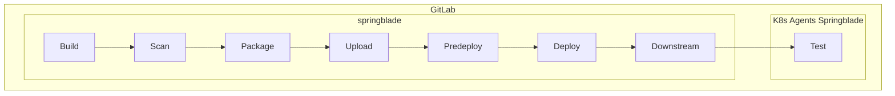
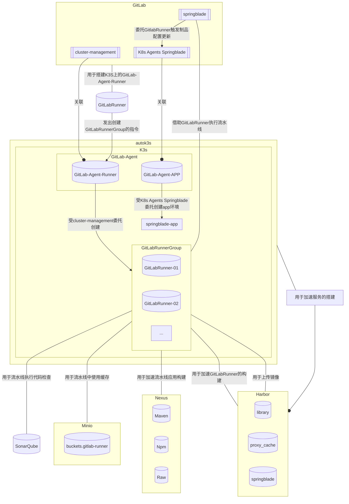

# 开发运营之路（The Road To DevOps）

## 背景

随着微服务的热度不断上升，开发团队都希望有一个**高性价比**和**更现代**的自动化编译和部署的工具或系统来协助众多微服务模块的开发。

## 目标

基于私有搭建Gitlab，完成DevOps全流程。

## 名词解析

1. springblade ：一个微服务应用项目

## 技术栈

<table>
  <tr>
    <td>
      
    </td>
  </tr>
  <tr>
    <td align=center>
      GitLab
    </td>
  </tr>
</table>

## DevOps流程

需求分析 -> 新建分支 -> 代码编写 -> 代码请求合并 -> 代码审查 -> 代码合并 -> 代码编译 -> 代码检查 -> 单元测试 -> 检查结果上传 -> 制品生成 -> 制品上传 -> 制品部署脚本更新 ->制品部署 -> 自动化测试

### 流水线

#### 流水线详情

## 基于私有搭建Gitlab的DevOps实践

### 架构图

### 架构搭建

#### 搭建步骤

1. 创建基础服务
    1.1. 创建Harbor
    1.2. 创建Minio
    1.3. 创建Nexus
    1.4. 创建SonarQube
2. 搭建GitLab
3. 搭建GitLab Runner并关联到GitLab
4. 搭建autoK3s，创建K3s实例
5. 在GitLab上创建项目cluster-management,并在K3s实例上创建GitLab-Agent-Runner
6. 执行cluster-management流水线，创建GitLabRunnerGroup
7. GitLab上创建项目微服务应用springblade
8. GitLab上创建项目微服务环境代理项目K8s-Agents-Springblade，并在K3s实例上创建GitLab-Agent-APP
9. 执行springblade流水线（生成新的微服务镜像并且更新新的环境配置到K8s-Agents-Springblade）

#### 架构搭建详情

1. 创建Harbor
