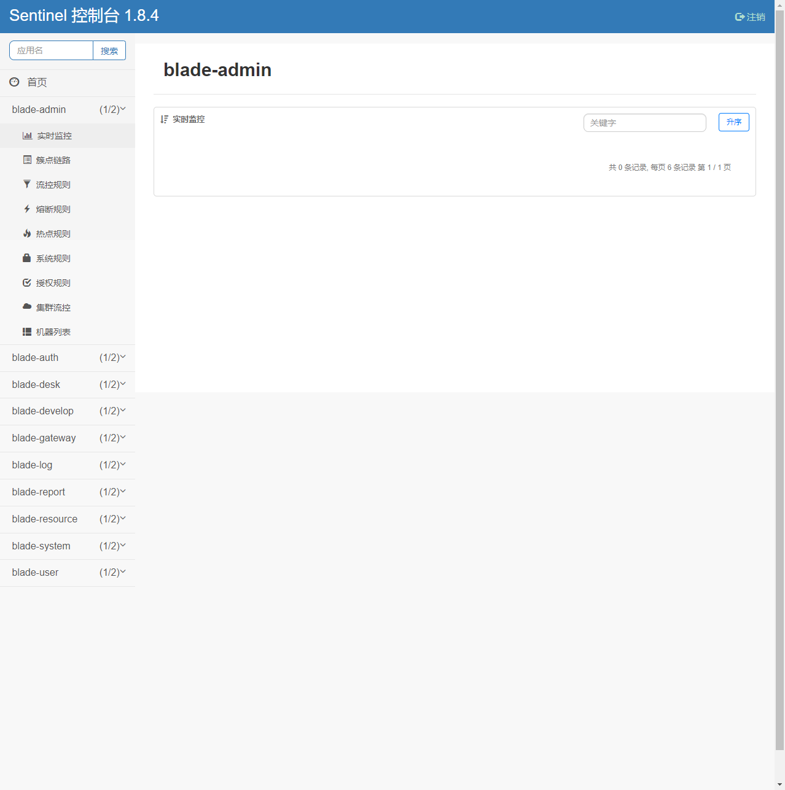

# 开发运营之路（The Road To DevOps）

## 背景

随着微服务的热度不断上升，开发团队都希望有一个**高性价比**和**更现代**的自动化编译和部署的工具或系统来协助众多微服务模块的开发。

## 目标

基于私有搭建Gitlab和其他开源项目，完成DevOps全流程。

## 名词解析

1. Gitlab：主流的一站式Devops平台，提供代码保存，Issues管理，流水线管理等
2. Nexus： 老牌的二进制制品管理平台
3. Harbor： 主流的企业级镜像私库
4. Minio：主流的分布式存储系统
5. Docker： 主流的容器化工具
6. K3s： 轻量级Kubernetes
7. Autok3s： 用于简化 K3s 集群管理的轻量级工具
8. SonarQube： 主流的代码质量扫描工具平台
9. Dependency-Check： 代码依赖包安全漏洞检测
10. springblade ：一个微服务应用项目，仅用于测试Devops

## 技术栈

<table>
  <tr>
    <td align=center>
      
    </td>
  </tr>
  <tr>
    <td align=center>
      GitLab
    </td>
  </tr>
</table>
<p></p>
<table>
  <tr>
    <td align=center>
      
    </td>
    <td align=center style="background-color:#247bae">
      
    </td>
    <td align=center>
      
    </td>
  </tr>
  <tr>
    <td align=center>
      Nexus
    </td>
    <td align=center>
      Harbor
    </td>
    <td align=center>
      Minio
    </td>
  </tr>
</table>
<p></p>
<table>
  <tr>
  	<td align=center>
      
    </td>
    <td align=center>
      
    </td>
    <td align=center >
      
    </td>
  </tr>
  <tr>
  	<td align=center>
      Docker
    </td>
    <td align=center>
      K3s
    </td>
    <td align=center>
      Autok3s
    </td>
  </tr>
</table>
<p></p>
<table>
  <tr>
  	<td align=center>
      
    </td>
    <td align=center>
      
    </td>
  </tr>
  <tr>
  	<td align=center>
      sonarqube
    </td>
    <td align=center>
      dependency-check
    </td>
  </tr>
</table>

## DevOps流程实践

...->需求分析 -> 新建分支 -> 代码编写 -> 代码请求合并 -> 代码审查 -> 代码合并 -> 代码编译 -> 代码检查 -> 单元测试 -> 检查结果上传 -> 制品生成 -> 制品上传 -> 制品部署脚本更新 ->制品部署 -> 自动化测试->...

### 流水线实践

> 基于springblade基础上进行流水线的实践

#### 相关项目

https://github.com/Brick-Technology/cluster-management

https://github.com/Brick-Technology/springblade

https://github.com/Brick-Technology/k8s-agents-springblade


执行全景图


#### Build

1. build-be

   进行后端代码编译，顺带检查编译是否正常

   带给下个阶段.m2/repository的依赖

2. build-fe

   进行前端依赖的安装

   带给下个阶段ui/admin/node_modules的依赖

#### Scan

1. sonarqube-check-java

   进行后端（Java）依赖包漏洞检查和代码规范，Bug，单元测试覆盖率检查，并将检查报告上传到SonarQube

   带给下个阶段.m2/repository的依赖

2. sonarqube-check-js

   进行前端（Vuejs）代码规范检查，并将检查报告上传到SonarQube

   带给下个阶段ui/admin/node_modules的依赖

#### Package

1. java-package

​		进行后端jar文件指定版本的编译

​		带给下个阶段后端微服务的jar

2. npm-package

   进行前端的打包

   带给下个阶段前端dist目录

#### Upload

镜像编译，采用kaniko进行编译，特别的，针对私有的harbor（带SSL），编译镜像加入ca证书的信任操作

1. image-upload-saber-db： 后端微服务-应用数据库镜像编译
2. image-upload-nacos-db：后端微服务-nacos数据库镜像编译
3. image-upload-sentinel： 后端微服务-sentinel镜像编译
4. image-upload-blade-gateway： 后端微服务镜像编译
5. image-upload-blade-auth： 后端微服务镜像编译
6. image-upload-blade-admin： 后端微服务镜像编译
7. image-upload-blade-develop： 后端微服务镜像编译
8. image-upload-blade-report： 后端微服务镜像编译
9. image-upload-blade-resource： 后端微服务镜像编译
10. image-upload-blade-swagger： 后端微服务镜像编译
11. image-upload-blade-desk： 后端微服务镜像编译
12. image-upload-blade-log： 后端微服务镜像编译
13. image-upload-blade-system： 后端微服务镜像编译
14. image-upload-blade-user： 后端微服务镜像编译
15. image-upload-ui-admin： 前端镜像编译
16. jar-upload：jar上传到nexus，一般为release版本才进行该任务

#### Predeploy

1. predeploy：进行镜像更新信息的收集，主要将信息存在deploy.env的IMAGE_REF里，输入到下一个阶段

#### Deploy

1. deploy:dev： 触发**部署项目K8s Agents Springblade**的流水线，同时传递目标环境为dev和需要更新的镜像IMAGE_REF信息
2. deploy:test： 触发**部署项目K8s Agents Springblade**的流水线，同时传递目标环境为test和需要更新的镜像IMAGE_REF信息

#### K8s Agents Springblade：TEST


1. spring-blade:image:unpack： 拆解上一流水线传递的参数
2. spring-blade:image:update： 借助kustomize更新配置文件差异信息
3. spring-blade:image:commit： 提交改动的代码
4. hydrate-packages： 借助kustomize生成新的k8s部署yaml文件
5. update-packages： 提交更新后新的k8s部署yaml文件

### 效果图

#### 检测效果


#### 后端jar版本化效果


#### CI缓存


#### 镜像仓库效果


#### 微服务部署效果


#### 应用效果





## 基于私有搭建Gitlab的DevOps实践

### 架构图


### 系统要求

操作系统：Ubuntu 20+

### 架构搭建

1. 搭建基础服务
    1. 搭建Nexus
    2. 搭建Harbor
    3. 搭建Minio
    4. 搭建SonarQube
2. 搭建GitLab
3. 搭建GitLab Runner并关联到GitLab
4. 搭建autoK3s，创建K3s实例
5. 在GitLab上创建项目cluster-management,并在K3s实例上搭建GitLab-Agent-Runner
6. 执行cluster-management流水线，搭建GitLabRunnerGroup
8. 在GitLab上创建项目微服务环境代理项目K8s-Agents-Springblade，并在K3s实例上创建GitLab-Agent-APP
8. 在GitLab上创建项目微服务应用springblade
9. 执行springblade流水线（生成新的微服务镜像并且更新新的环境配置到K8s-Agents-Springblade）

#### 搭建Nexus

> 参考文章：[sonatype/docker-nexus3: Dockerized version of Nexus Repo Manager 3 (github.com)](https://github.com/sonatype/docker-nexus3)

##### 过程

1. 创建docker-compose.yml

```shell
# 创建docker-compose文件
cat > /usr/local/docker/nexus/docker-compose.yml << EOF
version: "2"

services:
  nexus:
    image: sonatype/nexus3:3.38.1
    environment:
      TZ: Asia/Shanghai
    volumes:
      - "nexus-data:/nexus-data"
    ports:
      - "8081:8081"
  
volumes:
  nexus-data: {}
EOF
```

2. 启动

```shell
# 进入工作目录
cd /usr/local/docker/nexus/
# 启动
docker-compose up -d
```

##### 最终文件结构

```
nexus/
└── docker-compose.yml
```

#### 搭建Harbor

> 参考文章：[Harbor docs | Download the Harbor Installer (goharbor.io)](https://goharbor.io/docs/2.5.0/install-config/download-installer/)

##### 过程

1. 下载离线安装包[Releases · goharbor/harbor · GitHub](https://github.com/goharbor/harbor/releases)

```shell
#下载离线安装包
wget -c https://github.com/goharbor/harbor/releases/download/v2.5.0/harbor-offline-installer-v2.5.0.tgz
#解压
tar xzvf harbor-offline-installer-v2.5.0.tgz
```

2. 配置https

```shell
#创建密钥
openssl genrsa -out 192.168.2.29.key -passout pass:783a544f59d298255005a0f39c8bea52 -des3 2048 

#创建证书配置
cat > 192.168.2.29.cnf << EOF
[ req ]
default_bits           = 2048
default_keyfile        = 192.168.2.29.key
distinguished_name     = req_distinguished_name
attributes             = req_attributes
prompt                 = no
output_password        = 783a544f59d298255005a0f39c8bea52

[ req_distinguished_name ]
C                      = CN
ST                     = Test State or Province
L                      = Test Locality
O                      = Organization Name
OU                     = Organizational Unit Name
CN                     = 192.168.2.29
emailAddress           = test@email.address

[ req_attributes ]
challengePassword              = c294bd40ad4956fefbef
EOF
openssl req -new -key 192.168.2.29.key -passin pass:783a544f59d298255005a0f39c8bea52 -out 192.168.2.29.csr -config 192.168.2.29.cnf
cat > v3.ext << EOF
authorityKeyIdentifier=keyid,issuer
basicConstraints=CA:TRUE
keyUsage = keyCertSign, digitalSignature, nonRepudiation, keyEncipherment, dataEncipherment
subjectAltName = DNS.1:192.168.2.29,DNS.2:127.0.0.1,DNS.3:localhost,IP.1:192.168.2.29,IP.2:127.0.0.1
EOF
#创建证书
openssl x509 -in 192.168.2.29.csr -passin pass:783a544f59d298255005a0f39c8bea52 -out 192.168.2.29.crt -req -signkey 192.168.2.29.key -days 3650 -sha256 -extfile v3.ext

#备份有加密的密钥
cp 192.168.2.29.key 192.168.2.29.key.bak

#导出无加密的密钥
openssl rsa -in 192.168.2.29.key.bak -passin pass:783a544f59d298255005a0f39c8bea52 -out 192.168.2.29.key
```

3. 配置harbor.yml文件

```yaml
# Configuration file of Harbor

# The IP address or hostname to access admin UI and registry service.
# DO NOT use localhost or 127.0.0.1, because Harbor needs to be accessed by external clients.
hostname: 192.168.2.29

# http related config
http:
# port for http, default is 80. If https enabled, this port will redirect to https port
port: 8083

# https related config
https:
# https port for harbor, default is 443
port: 8443
# The path of cert and key files for nginx
certificate: /usr/local/docker/ssl/192.168.2.29.crt
private_key: /usr/local/docker/ssl/192.168.2.29.key
...
```

4. 执行安装脚本

```
./install.sh
```

##### 最终文件结构

```
.
├── harbor
│   ├── harbor
│   │   ├── common
│   │   │   └── config
│   │   │       ├── core
│   │   │       │   ├── app.conf
│   │   │       │   ├── certificates
│   │   │       │   └── env
│   │   │       ├── db
│   │   │       │   └── env
│   │   │       ├── jobservice
│   │   │       │   ├── config.yml
│   │   │       │   └── env
│   │   │       ├── log
│   │   │       │   ├── logrotate.conf
│   │   │       │   └── rsyslog_docker.conf
│   │   │       ├── nginx
│   │   │       │   ├── conf.d
│   │   │       │   └── nginx.conf
│   │   │       ├── portal
│   │   │       │   └── nginx.conf
│   │   │       ├── registry
│   │   │       │   ├── config.yml
│   │   │       │   ├── passwd
│   │   │       │   └── root.crt
│   │   │       ├── registryctl
│   │   │       │   ├── config.yml
│   │   │       │   └── env
│   │   │       └── shared
│   │   │           └── trust-certificates
│   │   ├── common.sh
│   │   ├── docker-compose.yml
│   │   ├── harbor.v2.5.0.tar.gz
│   │   ├── harbor.yml
│   │   ├── harbor.yml.tmpl
│   │   ├── install.sh
│   │   ├── LICENSE
│   │   └── prepare
│   └── harbor-offline-installer-v2.5.0.tgz
└── ssl
    ├── 192.168.2.29.cnf
    ├── 192.168.2.29.crt
    ├── 192.168.2.29.csr
    ├── 192.168.2.29.key
    ├── 192.168.2.29.key.bak
    └── v3.ext
```

#### 搭建Minio

> 参考文章：[MinIO | Deploy MinIO on Docker Compose](https://docs.min.io/docs/deploy-minio-on-docker-compose)
>
> 账号：minioadmin 密码：minioadmin

##### 过程

1. 创建docker-compose.yml

```shell
cat > /usr/local/docker/minio/docker-compose.yaml << EOF
version: '3.7'

# Settings and configurations that are common for all containers
x-minio-common: &minio-common
  image: minio/minio:RELEASE.2022-05-08T23-50-31Z
  command: server --console-address ":9001" http://minio{1...4}/data{1...2}
  expose:
    - "9000"
    - "9001"
  # environment:
    # MINIO_ROOT_USER: minioadmin
    # MINIO_ROOT_PASSWORD: minioadmin
  healthcheck:
    test: ["CMD", "curl", "-f", "http://locaslhost:9000/minio/health/live"]
    interval: 30s
    timeout: 20s
    retries: 3

# starts 4 docker containers running minio server instances.
# using nginx reverse proxy, load balancing, you can access
# it through port 9000.
services:
  minio1:
    <<: *minio-common
    hostname: minio1
    volumes:
      - data1-1:/data1
      - data1-2:/data2

  minio2:
    <<: *minio-common
    hostname: minio2
    volumes:
      - data2-1:/data1
      - data2-2:/data2

  minio3:
    <<: *minio-common
    hostname: minio3
    volumes:
      - data3-1:/data1
      - data3-2:/data2

  minio4:
    <<: *minio-common
    hostname: minio4
    volumes:
      - data4-1:/data1
      - data4-2:/data2

  nginx:
    image: nginx:1.19.2-alpine
    hostname: nginx
    volumes:
      - ./nginx.conf:/etc/nginx/nginx.conf:ro
    ports:
      - "9000:9000"
      - "9001:9001"
    depends_on:
      - minio1
      - minio2
      - minio3
      - minio4

## By default this config uses default local driver,
## For custom volumes replace with volume driver configuration.
volumes:
  data1-1:
  data1-2:
  data2-1:
  data2-2:
  data3-1:
  data3-2:
  data4-1:
  data4-2:
EOF
```

2. 创建nginx.conf

```shell
cat > /usr/local/docker/minio/nginx.conf << \EOF
user  nginx;
worker_processes  auto;

error_log  /var/log/nginx/error.log warn;
pid        /var/run/nginx.pid;

events {
    worker_connections  4096;
}

http {
    include       /etc/nginx/mime.types;
    default_type  application/octet-stream;

    log_format  main  '$remote_addr - $remote_user [$time_local] "$request" '
                      '$status $body_bytes_sent "$http_referer" '
                      '"$http_user_agent" "$http_x_forwarded_for"';

    access_log  /var/log/nginx/access.log  main;
    sendfile        on;
    keepalive_timeout  65;

    # include /etc/nginx/conf.d/*.conf;

    upstream minio {
        server minio1:9000;
        server minio2:9000;
        server minio3:9000;
        server minio4:9000;
    }

    upstream console {
        ip_hash;
        server minio1:9001;
        server minio2:9001;
        server minio3:9001;
        server minio4:9001;
    }

    server {
        listen       9000;
        listen  [::]:9000;
        server_name  localhost;

        # To allow special characters in headers
        ignore_invalid_headers off;
        # Allow any size file to be uploaded.
        # Set to a value such as 1000m; to restrict file size to a specific value
        client_max_body_size 0;
        # To disable buffering
        proxy_buffering off;
        proxy_request_buffering off;

        location / {
            proxy_set_header Host $http_host;
            proxy_set_header X-Real-IP $remote_addr;
            proxy_set_header X-Forwarded-For $proxy_add_x_forwarded_for;
            proxy_set_header X-Forwarded-Proto $scheme;

            proxy_connect_timeout 300;
            # Default is HTTP/1, keepalive is only enabled in HTTP/1.1
            proxy_http_version 1.1;
            proxy_set_header Connection "";
            chunked_transfer_encoding off;

            proxy_pass http://minio;
        }
    }

    server {
        listen       9001;
        listen  [::]:9001;
        server_name  localhost;

        # To allow special characters in headers
        ignore_invalid_headers off;
        # Allow any size file to be uploaded.
        # Set to a value such as 1000m; to restrict file size to a specific value
        client_max_body_size 0;
        # To disable buffering
        proxy_buffering off;
        proxy_request_buffering off;

        location / {
            proxy_set_header Host $http_host;
            proxy_set_header X-Real-IP $remote_addr;
            proxy_set_header X-Forwarded-For $proxy_add_x_forwarded_for;
            proxy_set_header X-Forwarded-Proto $scheme;
            proxy_set_header X-NginX-Proxy true;

            # This is necessary to pass the correct IP to be hashed
            real_ip_header X-Real-IP;

            proxy_connect_timeout 300;

            # To support websocket
            proxy_http_version 1.1;
            proxy_set_header Upgrade $http_upgrade;
            proxy_set_header Connection "upgrade";

            chunked_transfer_encoding off;

            proxy_pass http://console;
        }
    }
}
EOF
```

3. 启动

```shell
# 进入工作目录
cd /usr/local/docker/minio/
# 启动
docker-compose up -d
```

##### 最终文件结构

```
minio/
├── docker-compose.yaml
└── nginx.conf
```

#### 搭建SonarQube

##### 前置操作

配置linux系统，修改系统参数

```shell
sysctl -w vm.max_map_count=524288
sysctl -w fs.file-max=131072
ulimit -n 131072
ulimit -u 8192

vi /etc/security/limits.conf
# *　　soft　　nofile　　131072
# *　　hard　　nofile　　131072
# *　　soft　　nproc   8192
# *　　hard　　nproc   8192

vi /etc/sysctl.conf
# vm.max_map_count=524288
# fs.file-max=131072
```

##### 过程

1. 创建docker-compose.yml

```shell
cat > /usr/local/docker/sonarqube/docker-compose.yaml << EOF
version: "3"

services:
  sonarqube:
    image: mc1arke/sonarqube-with-community-branch-plugin:9.3-community
    depends_on:
      - db
    environment:
      TZ: Asia/Shanghai
      SONAR_JDBC_URL: jdbc:postgresql://db:5432/sonar
      SONAR_JDBC_USERNAME: sonar
      SONAR_JDBC_PASSWORD: sonar
    volumes:
      - sonarqube_data:/opt/sonarqube/data
      - sonarqube_extensions:/opt/sonarqube/extensions
      - sonarqube_logs:/opt/sonarqube/logs
      - ./sonar-dependency-check-plugin-3.0.1.jar:/opt/sonarqube/extensions/plugins/sonar-dependency-check-plugin-3.0.1.jar
    ports:
      - "9000:9000"
  db:
    image: postgres:13
    environment:
      TZ: Asia/Shanghai
      POSTGRES_USER: sonar
      POSTGRES_PASSWORD: sonar
    volumes:
      - postgresql:/var/lib/postgresql
      - postgresql_data:/var/lib/postgresql/data

volumes:
  sonarqube_data:
  sonarqube_extensions:
  sonarqube_logs:
  postgresql:
  postgresql_data:
EOF
```

2. 下载sonar-dependency-check-plugin

```shell
wget https://github.com/dependency-check/dependency-check-sonar-plugin/releases/download/3.0.1/sonar-dependency-check-plugin-3.0.1.jar
```

3. 启动

```
# 进入工作目录
cd /usr/local/docker/sonarqube/
# 启动
docker-compose up -d
```

##### 最终文件结构

```
sonarqube/
├── docker-compose.yml
└── sonar-dependency-check-plugin-3.0.1.jar
```

#### 搭建GitLab

> 参考文章：[GitLab Docker images | GitLab](https://docs.gitlab.com/ee/install/docker.html)

##### 过程

1. 准备docker gitlab目录

```shell
mkdir -p /usr/local/docker/gitlab
mkdir /usr/local/docker/gitlab/volume/
mkdir /usr/local/docker/gitlab/volume/config
mkdir /usr/local/docker/gitlab/volume/logs
mkdir /usr/local/docker/gitlab/license/
```

2. 配置ssl

```
mkdir /usr/local/docker/gitlab/volume/config/ssl
cd /usr/local/docker/gitlab/volume/config/ssl
```

```shell
#创建密钥
openssl genrsa -out 192.168.2.28.key -passout pass:783a544f59d298255005a0f39c8bea52 -des3 2048 
#创建证书配置
cat > 192.168.2.28.cnf << EOF
[ req ]
default_bits           = 2048
default_keyfile        = 192.168.2.28.key
distinguished_name     = req_distinguished_name
attributes             = req_attributes
prompt                 = no
output_password        = 783a544f59d298255005a0f39c8bea52

[ req_distinguished_name ]
C                      = CN
ST                     = Test State or Province
L                      = Test Locality
O                      = Organization Name
OU                     = Organizational Unit Name
CN                     = 192.168.2.28
emailAddress           = test@email.address

[ req_attributes ]
challengePassword              = c294bd40ad4956fefbef
EOF
openssl req -new -key 192.168.2.28.key -passin pass:783a544f59d298255005a0f39c8bea52 -out 192.168.2.28.csr -config 192.168.2.28.cnf
cat > v3.ext << EOF
authorityKeyIdentifier=keyid,issuer
basicConstraints=CA:TRUE
keyUsage = keyCertSign, digitalSignature, nonRepudiation, keyEncipherment, dataEncipherment
subjectAltName = DNS.1:192.168.2.28,DNS.2:127.0.0.1,DNS.3:localhost,IP.1:192.168.2.28,IP.2:127.0.0.1
EOF
#创建证书
openssl x509 -in 192.168.2.28.csr -passin pass:783a544f59d298255005a0f39c8bea52 -out 192.168.2.28.crt -req -signkey 192.168.2.28.key -days 3650 -sha256 -extfile v3.ext
#备份有加密的密钥
#If the certificate.key file is password protected, NGINX will not ask for the password when you reconfigure GitLab. In that case, Omnibus GitLab will fail silently with no error messages. To remove the password from the key, run:
cp 192.168.2.28.key 192.168.2.28.key.bak
#导出无加密的密钥
openssl rsa -in 192.168.2.28.key.bak -passin pass:783a544f59d298255005a0f39c8bea52 -out 192.168.2.28.key
```

3. 创建docker-compose.yml

```shell
cat > /usr/local/docker/gitlab/docker-compose.yml << EOF
gitlab:
  image: 'gitlab/gitlab-ee:15.0.0-ee.0'
  restart: always
  hostname: '192.168.2.28'
  environment:
    TZ: Asia/Shanghai
    GITLAB_OMNIBUS_CONFIG: |
      external_url 'https://192.168.2.28'
      nginx['redirect_http_to_https_port'] = 80
      puma['exporter_enabled'] = true
      puma['exporter_port'] = 443
      gitlab_rails['gitlab_shell_ssh_port'] = 2022
      nginx['enable'] = true
      registry_external_url 'https://192.168.2.28:4567'
      registry_nginx['redirect_http_to_https'] = true
      gitlab_kas['enable'] = true
      gitlab_kas['gitlab_address'] = "https://127.0.0.1"
  command: sh -c "update-ca-certificates & /assets/wrapper"
  ports:
    - '80:80'
    - '443:443'
    - '2022:22'
    - '4567:4567'
  volumes:
    - './volume/config:/etc/gitlab'
    - './volume/logs:/var/log/gitlab'
    - './volume/data:/var/opt/gitlab'
    - './volume/config/ssl/192.168.2.28.crt:/usr/local/share/ca-certificates/192.168.2.28.crt'
EOF
```

4. 启动

```shell
# 进入工作目录
cd /usr/local/docker/gitlab
# 启动
docker-compose up -d
```

5. 获取root账号初始密码

```shell
cat /usr/local/docker/gitlab/volume/config/initial_root_password
```

##### 最终文件结构

```
gitlab
├── docker-compose.yml
├── license
└── volume
	├── config
		├──ssl
            ├── 192.168.2.28.cnf
            ├── 192.168.2.28.crt
            ├── 192.168.2.28.csr
            ├── 192.168.2.28.key
            ├── 192.168.2.28.key.bak
            └── v3.ext
    ├── data
    └── logs
```

#### 搭建GitLab Runner

> 参考文章：[Run GitLab Runner in a container | GitLab](https://docs.gitlab.com/runner/install/docker.html)

##### 过程

1. 配置gitlab SSL证书

```shell
mkdir -p /usr/local/docker/gitlab-runner/volume/certs/
#复制gitlab的https证书文件
cat > /usr/local/docker/gitlab-runner/volume/certs/ca.crt << EOF
-----BEGIN CERTIFICATE-----
MIIFVjCCBD6gAwIBAgIUOPCKjLP4ZiBsY02cWzOU8QR2eMgwDQYJKoZIhvcNAQEL
BQAwgb8xCzAJBgNVBAYTAkNOMR8wHQYDVQQIDBZUZXN0IFN0YXRlIG9yIFByb3Zp
bmNlMRYwFAYDVQQHDA1UZXN0IExvY2FsaXR5MRowGAYDVQQKDBFPcmdhbml6YXRp
b24gTmFtZTEhMB8GA1UECwwYT3JnYW5pemF0aW9uYWwgVW5pdCBOYW1lMRUwEwYD
VQQDDAwxOTIuMTY4LjIuMjgxITAfBgkqhkiG9w0BCQEWEnRlc3RAZW1haWwuYWRk
cmVzczAeFw0yMjA0MTcxMzU1MDRaFw0zMjA0MTQxMzU1MDRaMIG/MQswCQYDVQQG
EwJDTjEfMB0GA1UECAwWVGVzdCBTdGF0ZSBvciBQcm92aW5jZTEWMBQGA1UEBwwN
VGVzdCBMb2NhbGl0eTEaMBgGA1UECgwRT3JnYW5pemF0aW9uIE5hbWUxITAfBgNV
BAsMGE9yZ2FuaXphdGlvbmFsIFVuaXQgTmFtZTEVMBMGA1UEAwwMMTkyLjE2OC4y
LjI4MSEwHwYJKoZIhvcNAQkBFhJ0ZXN0QGVtYWlsLmFkZHJlc3MwggEiMA0GCSqG
SIb3DQEBAQUAA4IBDwAwggEKAoIBAQDr3RyzLjg75zPKvrDAn9Iv2WLEXiaHAm48
9fwq66jAOHpIcyc3uobx0xxlxBeBnPgpozjwTDXeDkL2Zpgg/u/ME1OfiUVsPu/p
Ez+5yNENH7BteuhHruEZqkkzJYf3/Z8Jo7fpJiZLfwen0xLn9H3kMbzEIE2tnCpY
qcjnpmXbLcCFvf/0Sz4EkxBjdRWwa/8PX7eC9Lx08wDA7FNoTXCDhIW6/SfRQCCE
mzqDVGnabsSdBh/SJX1k5PmBQ4N4VLMgAjnKPetIDrWrXDTLXNqeC1bFkTb+gx4W
TkNMK2BL0ahvF9ywRevpgwbsXFNb/dnUP4dEsHbqvo+xZ+TFiIyDAgMBAAGjggFG
MIIBQjCB6QYDVR0jBIHhMIHeoYHFpIHCMIG/MQswCQYDVQQGEwJDTjEfMB0GA1UE
CAwWVGVzdCBTdGF0ZSBvciBQcm92aW5jZTEWMBQGA1UEBwwNVGVzdCBMb2NhbGl0
eTEaMBgGA1UECgwRT3JnYW5pemF0aW9uIE5hbWUxITAfBgNVBAsMGE9yZ2FuaXph
dGlvbmFsIFVuaXQgTmFtZTEVMBMGA1UEAwwMMTkyLjE2OC4yLjI4MSEwHwYJKoZI
hvcNAQkBFhJ0ZXN0QGVtYWlsLmFkZHJlc3OCFDjwioyz+GYgbGNNnFszlPEEdnjI
MAwGA1UdEwQFMAMBAf8wCwYDVR0PBAQDAgL0MDkGA1UdEQQyMDCCDDE5Mi4xNjgu
Mi4yOIIJMTI3LjAuMC4xgglsb2NhbGhvc3SHBMCoAhyHBH8AAAEwDQYJKoZIhvcN
AQELBQADggEBAJa253Iv8xNAj0cOt36oD3AIlYPfbPZCBz6LfXgMSH/IBPPkNa4j
9NlQsPAdmiwiDblkA++mZHvLtrKqer2QqOFdo41j90M93zB6RexFC3V5N58KqkJr
woVR8ucUnFZoerT8EFIKYYQkg0BjAM/JKORJjijDZcdoqvMliXIniUOcoZJ+PzfA
SR46QF46HMLo+K9+bfAqRULRy4I+349t5DbTSZf8ximSt7SFiF3ISvPgteybY3Fm
K9VtBaMOTQz3QFo1XyiCch+W01b2jIWsy9FdqlSrImUDWM7+vdcrC3lmnIrNwMpe
6xSgO3PEGryrGiwtU4vs5A76VWt/YWqJSJU=
-----END CERTIFICATE-----
EOF
```

2. 创建docker-compose.yml

```shell
mkdir /usr/local/docker/gitlab-runner/
cat > /usr/local/docker/gitlab-runner/docker-compose.yml << EOF
version: "3"
services:
  gitlab-runner:
      environment:
          TZ: Asia/Shanghai
      image: 'gitlab/gitlab-runner:alpine3.15-bleeding'
      restart: always
      volumes:
        - /var/run/docker.sock:/var/run/docker.sock
        - ./volume/config:/etc/gitlab-runner
        - ./volume/certs/ca.crt:/etc/gitlab-runner/certs/ca.crt
EOF
```

3. 启动

```shell
#进入工作目录
cd /usr/local/docker/gitlab-runner/
#启动
docker-compose up -d
```

4. 关联Runner到GitLab，注册Runner，根据提示填写

```shell
docker-compose exec -T gitlab-runner gitlab-runner register

# Enter the default Dokcer image: alpine:3.15.4
# 注意，不需要填写tag
```

5. 修改Runner配置，主要修改以下配置，来适配GitLab的SSL

```
...
  tls-ca-file = "/certs/ca.crt"
...
    tls_verify = true
...
    volumes = ["/cache","/certs"]
```

​	下面是参考文件，主要添加了minio作为Runner的缓存（重点关注runners.cache）

```shell
concurrent = 1
check_interval = 0

[session_server]
  session_timeout = 1800

[[runners]]
  name = "main"
  url = "https://192.168.2.28/"
  token = "AByQqCWabwR-UtsPLMet"
  executor = "docker"
  tls-ca-file = "/certs/ca.crt"
  [runners.custom_build_dir]
  [runners.cache]
    Type = "s3"
    Shared = false
    [runners.cache.s3]
      ServerAddress = "192.168.2.29:9000"
      AccessKey = "6zjN2u3ujFNEVSGu"
      SecretKey = "XK3PG7aNK8MWjVISOcHfldMsgGHv2kpb"
      BucketName = "gitlab-runner"
      BucketLocation = "cache"
      Insecure = true
    [runners.cache.gcs]
    [runners.cache.azure]
  [runners.docker]
    tls_verify = true
    image = "alpine:3.15.4"
    privileged = false
    disable_entrypoint_overwrite = false
    oom_kill_disable = false
    disable_cache = false
    volumes = ["/cache","/certs"]
    shm_size = 0
```

##### 最终文件结构

```
gitlab-runner/
├── docker-compose.yml
└── volume
    ├── certs
    │   └── ca.crt
    └── config
        ├── certs
        │   └── ca.crt
        ├── config.toml
        └── config.toml.backup
```

##### 常见问题

1. 如果执行pipeline时遇到ssl证书问题`x509: certificate signed by unknown authority`，则需要在docker-compose所在宿主机信任证书

```
Error response from daemon: Get "https://192.168.2.29:8443/v2/": x509: certificate signed by unknown authority
```

#### 搭建Autok3s

> 参考文章：https://github.com/cnrancher/autok3s
>
> 特别注意：./volume/data/certs/192.168.2.29.crt，的作用为集群提供harbor服务的SSL

##### 过程

1. 创建docker-compose.yml

```shell
mkdir -p /usr/local/docker/autok3s/
mkdir -p /usr/local/docker/autok3s/volume/certs/
cat > /usr/local/docker/autok3s/docker-compose.yml << EOF
version: "3"
services:
  autok3s:
    image: cnrancher/autok3s:v0.4.9
    restart: always
    network_mode: "host"
    volumes:
      - ./volume/data:/root/.autok3s
      - ./volume/data/certs:/etc/ssl/certs/
      - /var/run/docker.sock:/var/run/docker.sock
EOF
```

2. 启动

```shell
cd /usr/local/docker/autok3s/ && docker-compose up -d
```

##### 最终文件结构

```
autok3s/
├── docker-compose.yml
└── volume
    └── data
        ├── certs
        │   └── 192.168.2.29.crt
        └── logs
```

#### 借助Autok3s搭建K3s实例

> 参考文章： [创建K3d集群 | Rancher文档](https://docs.rancher.cn/docs/k3s/autok3s/k3d/_index)
>
> http://192.168.2.30:8080/ui/cluster-explorer/core/clusters/create?defaultProvider=k3d

##### 过程

1. 进入AutoK3s Explorer
2. 点击Create
3. 选择Provider k3d，填写Name，和其他参数（特别地：注意Volumes，Ports，Registry）

参考配置

1. devops-with-certs

```
autok3s create --provider k3d --master 1 --name devops-with-certs --token 3ae4a9aea926a189a748ab7d0652f21c --worker 3 --k3s-install-script https://get.k3s.io --api-port 0.0.0.0:41321 --image rancher/k3s:v1.21.7-k3s1 --ports '80:80@loadbalancer' --ports '443:443@loadbalancer' --volumes '/usr/local/docker/autok3s/volume/data/certs/192.168.2.29.crt:/etc/ssl/certs/192.168.2.29.crt' --registry mirrors: docker.io: endpoint: - "https://registry.cn-hangzhou.aliyuncs.com/" configs: "192.168.2.29:8443": tls: ca_file: /etc/ssl/certs/192.168.2.29.crt
```

2. devops-with-certs-app-2

```
autok3s create --provider k3d --master 1 --name devops-with-certs-app-2 --token 38cee1415287d7eae5456f2a75492909 --worker 3 --k3s-install-script https://get.k3s.io --api-port 0.0.0.0:41322 --image rancher/k3s:v1.21.7-k3s1 --ports '8081:80@loadbalancer' --ports '8443:443@loadbalancer' --ports '30000:30000@loadbalancer' --ports '30001:30001@loadbalancer' --ports '30002:30002@loadbalancer' --ports '30003:30003@loadbalancer' --ports '30004:30004@loadbalancer' --ports '31000:31000@loadbalancer' --ports '31001:31001@loadbalancer' --ports '31002:31002@loadbalancer' --ports '31003:31003@loadbalancer' --ports '31004:31004@loadbalancer' --volumes '/usr/local/docker/autok3s/volume/data/certs/192.168.2.29.crt:/etc/ssl/certs/192.168.2.29.crt' --registry mirrors: docker.io: endpoint: - "https://registry.cn-hangzhou.aliyuncs.com/" configs: "192.168.2.29:8443": tls: ca_file: /etc/ssl/certs/192.168.2.29.crt
```

#### 在GitLab上创建项目cluster-management

> 模板项目https://gitlab.com/gitlab-org/project-templates/cluster-management.git

##### 过程

1. 导入模板项目

2. 新增.gitlab/agents/test-agent/config.yaml，该文件的作用是使得流水线的项目能使用当前注册的k8s集群环境

   内容参考：

```
ci_access:
  projects:
  - id: lastsunday/cluster-management
```

3. 修改helmfile.yaml（主要开启gitlab-runner）

```
helmDefaults:
  atomic: true
  wait: true

  # ---------------------  IMPORTANT ---------------------------
  # Uncomment the paths below for the applications that you'd like to manage.
  # By default all the helmfiles have `install:true`. So if you uncomment one of these
  # helmfiles, the associated application will be tried to be installed or updated.
  #
  # You can set `install:false` to either uninstall the app from your cluster, or
  # keep it uninstalled if you don't have it already installed.
  #
  # For more information, reference the Helmfile repository at:
  # https://github.com/roboll/helmfile
  # ------------------------------------------------------------

helmfiles:

#  - path: applications/cilium/helmfile.yaml
#  - path: applications/ingress/helmfile.yaml
#  - path: applications/cert-manager/helmfile.yaml
#  - path: applications/sentry/helmfile.yaml
   - path: applications/gitlab-runner/helmfile.yaml
#  - path: applications/elastic-stack/helmfile.yaml
#  - path: applications/prometheus/helmfile.yaml
#  - path: applications/vault/helmfile.yaml
#  - path: applications/fluentd/helmfile.yaml
#  - path: applications/falco/helmfile.yaml
#  - path: applications/apparmor/helmfile.yaml

# DEPRECATED: cert-manager-legacy SHOULD NOT be used for new installations. It
# DOES NOT WORK on Kubernetes versions 1.20 or newer. It can be used to take
# over an existing cert-manager release from GitLab 13.x. But even then, it is
# recommneded that you upgrade as soon as possible, because it WILL BREAK on
# Kubernetes 1.20 and newer.
#
#  - path: applications/cert-manager-legacy/helmfile.yaml

```

4. 修改gitlab-ci.yml

```
.kube-context:
  before_script:
    - echo "$CA_CERTIFICATE" >> /usr/local/share/ca-certificates/ca-certificates.crt
    - update-ca-certificates
    - if [ -n "$KUBE_CONTEXT" ]; then kubectl config use-context "$KUBE_CONTEXT"; fi
    - kubectl get pods -n gitlab-agent

apply:
  tags: 
    - main
  extends: [.kube-context]
  stage: deploy
  # image: "registry.gitlab.com/gitlab-org/cluster-integration/cluster-applications:v1.3.2"
  image: "192.168.2.29:8443/library/cluster-integration/cluster-applications:v1.3.2"
  environment:
    name: production
  script:
    - gl-ensure-namespace gitlab-managed-apps
    - gl-helmfile --file $CI_PROJECT_DIR/helmfile.yaml apply --suppress-secrets
  rules:
    - if: $CI_COMMIT_BRANCH == $CI_DEFAULT_BRANCH
```

5. 修改values.yaml.gotmpl

```
## REQUIRED VALUES
gitlabUrl: {{ requiredEnv "CI_SERVER_URL" | quote }}
runnerRegistrationToken: {{ requiredEnv "GITLAB_RUNNER_REGISTRATION_TOKEN" | quote }}

### custom

image: 192.168.2.29:8443/proxy_cache/gitlab/gitlab-runner:v14.10.0
imagePullPolicy: IfNotPresent
certsSecretName: custom-gitlab-crt
envVars:
  - name: RUNNER_EXECUTOR
    value: kubernetes
  - name: CI_SERVER_TLS_CA_FILE
    value: /home/gitlab-runner/.gitlab-runner/certs/custom-gitlab.crt
  - name: CONFIG_FILE
    value: /home/gitlab-runner/.gitlab-runner/config.toml
  - name: tls_verify
    value: false
###

## Configure the maximum number of concurrent jobs
## - Documentation: https://docs.gitlab.com/runner/configuration/advanced-configuration.html#the-global-section
## - Default value: 10
## - Currently don't support auto-scaling.
concurrent: 4

## Defines in seconds how often to check GitLab for a new builds
## - Documentation: https://docs.gitlab.com/runner/configuration/advanced-configuration.html#the-global-section
## - Default value: 3
checkInterval: 3

## For RBAC support
rbac:
  create: true
  clusterWideAccess: false

## Configuration for the Pods that that the runner launches for each new job
runners:
  image: ubuntu:20.04
  builds: {}
  services: {}
  helpers: 
    image: "192.168.2.29:8443/proxy_cache/gitlab/gitlab-runner-helper:x86_64-${CI_RUNNER_REVISION}"
  config: |
    [[runners]]
      [runners.kubernetes]
        image = "ubuntu:20.04"
        [runners.cache]
          Type = "s3"
          Path = "runner"
          Shared = true
          [runners.cache.s3]
            ServerAddress = "192.168.2.29:9000"
            BucketName = "gitlab-runner"
            BucketLocation = "cache"
            Insecure = true
            AuthenticationType = "access-key"

  cache:
      secretName: s3access

  ## Specify the tags associated with the runner. Comma-separated list of tags.
  ## - Documentation: https://docs.gitlab.com/ce/ci/runners/#using-tags
  tags: kubernetes,cluster

  ## Determine whether the runner should also run jobs without tags.
  ## - Documentation: https://docs.gitlab.com/ee/ci/runners/configure_runners.html#set-a-runner-to-run-untagged-jobs
  runUntagged: true

  ## Run all containers with the privileged flag enabled
  ## This will allow the docker:dind image to run if you need to run Docker
  ## commands. Please read the docs before turning this on:
  ## - Documentation: https://docs.gitlab.com/runner/executors/kubernetes.html#using-docker-dind
  privileged: false

  ## Kubernetes related options to control which nodes executors use
  ## - Documentation: https://kubernetes.io/docs/concepts/scheduling-eviction/assign-pod-node/
  # nodeSelector:
  #   myLabel: myValue
  #
  ## Documentation: https://kubernetes.io/docs/concepts/scheduling-eviction/taint-and-toleration/
  # nodeTolerations:
  #   - key: myTaint
  #     operator: Equal
  #     value: myValue
  #     effect: NoSchedule

  ## If you can't find a setting you think should be here this may help:
  ##
  ## The gitlab-runner chart uses `templates/configmap.yaml` to configure runners
  ## `configmap.yaml`'s `data.register-the-runner` transforms this file into runner CLI options
  ## `configmap.yaml`'s `data.config.toml` and `data.config.template.toml` transform this file into the runner's config.toml
  ##
  ## - Source code for `configmap.yaml` https://gitlab.com/gitlab-org/charts/gitlab-runner/-/blob/main/templates/configmap.yaml
  ## - Documentation for `config.toml` https://docs.gitlab.com/runner/executors/kubernetes.html#the-available-configtoml-settings
  ## - Source code for runner CLI options (see `KubernetesConfig` struct) https://gitlab.com/gitlab-org/gitlab-runner/-/blob/main/common/config.go

resources: {}

```

6. 添加SSL证书到命名空间gitlab-managed-apps

```shell
cat > custom-gitlab.crt <<EOF
-----BEGIN CERTIFICATE-----
MIIFVjCCBD6gAwIBAgIUOPCKjLP4ZiBsY02cWzOU8QR2eMgwDQYJKoZIhvcNAQEL
BQAwgb8xCzAJBgNVBAYTAkNOMR8wHQYDVQQIDBZUZXN0IFN0YXRlIG9yIFByb3Zp
bmNlMRYwFAYDVQQHDA1UZXN0IExvY2FsaXR5MRowGAYDVQQKDBFPcmdhbml6YXRp
b24gTmFtZTEhMB8GA1UECwwYT3JnYW5pemF0aW9uYWwgVW5pdCBOYW1lMRUwEwYD
VQQDDAwxOTIuMTY4LjIuMjgxITAfBgkqhkiG9w0BCQEWEnRlc3RAZW1haWwuYWRk
cmVzczAeFw0yMjA0MTcxMzU1MDRaFw0zMjA0MTQxMzU1MDRaMIG/MQswCQYDVQQG
EwJDTjEfMB0GA1UECAwWVGVzdCBTdGF0ZSBvciBQcm92aW5jZTEWMBQGA1UEBwwN
VGVzdCBMb2NhbGl0eTEaMBgGA1UECgwRT3JnYW5pemF0aW9uIE5hbWUxITAfBgNV
BAsMGE9yZ2FuaXphdGlvbmFsIFVuaXQgTmFtZTEVMBMGA1UEAwwMMTkyLjE2OC4y
LjI4MSEwHwYJKoZIhvcNAQkBFhJ0ZXN0QGVtYWlsLmFkZHJlc3MwggEiMA0GCSqG
SIb3DQEBAQUAA4IBDwAwggEKAoIBAQDr3RyzLjg75zPKvrDAn9Iv2WLEXiaHAm48
9fwq66jAOHpIcyc3uobx0xxlxBeBnPgpozjwTDXeDkL2Zpgg/u/ME1OfiUVsPu/p
Ez+5yNENH7BteuhHruEZqkkzJYf3/Z8Jo7fpJiZLfwen0xLn9H3kMbzEIE2tnCpY
qcjnpmXbLcCFvf/0Sz4EkxBjdRWwa/8PX7eC9Lx08wDA7FNoTXCDhIW6/SfRQCCE
mzqDVGnabsSdBh/SJX1k5PmBQ4N4VLMgAjnKPetIDrWrXDTLXNqeC1bFkTb+gx4W
TkNMK2BL0ahvF9ywRevpgwbsXFNb/dnUP4dEsHbqvo+xZ+TFiIyDAgMBAAGjggFG
MIIBQjCB6QYDVR0jBIHhMIHeoYHFpIHCMIG/MQswCQYDVQQGEwJDTjEfMB0GA1UE
CAwWVGVzdCBTdGF0ZSBvciBQcm92aW5jZTEWMBQGA1UEBwwNVGVzdCBMb2NhbGl0
eTEaMBgGA1UECgwRT3JnYW5pemF0aW9uIE5hbWUxITAfBgNVBAsMGE9yZ2FuaXph
dGlvbmFsIFVuaXQgTmFtZTEVMBMGA1UEAwwMMTkyLjE2OC4yLjI4MSEwHwYJKoZI
hvcNAQkBFhJ0ZXN0QGVtYWlsLmFkZHJlc3OCFDjwioyz+GYgbGNNnFszlPEEdnjI
MAwGA1UdEwQFMAMBAf8wCwYDVR0PBAQDAgL0MDkGA1UdEQQyMDCCDDE5Mi4xNjgu
Mi4yOIIJMTI3LjAuMC4xgglsb2NhbGhvc3SHBMCoAhyHBH8AAAEwDQYJKoZIhvcN
AQELBQADggEBAJa253Iv8xNAj0cOt36oD3AIlYPfbPZCBz6LfXgMSH/IBPPkNa4j
9NlQsPAdmiwiDblkA++mZHvLtrKqer2QqOFdo41j90M93zB6RexFC3V5N58KqkJr
woVR8ucUnFZoerT8EFIKYYQkg0BjAM/JKORJjijDZcdoqvMliXIniUOcoZJ+PzfA
SR46QF46HMLo+K9+bfAqRULRy4I+349t5DbTSZf8ximSt7SFiF3ISvPgteybY3Fm
K9VtBaMOTQz3QFo1XyiCch+W01b2jIWsy9FdqlSrImUDWM7+vdcrC3lmnIrNwMpe
6xSgO3PEGryrGiwtU4vs5A76VWt/YWqJSJU=
-----END CERTIFICATE-----
EOF
kubectl create secret generic custom-gitlab-crt \
  --namespace gitlab-managed-apps \
  --from-file=custom-gitlab.crt=custom-gitlab.crt
```

7. 为runner缓存配置minio的访问密钥

> 参考文章：[GitLab Runner Helm Chart | GitLab](https://docs.gitlab.com/runner/install/kubernetes.html#using-cache-with-configuration-template)
> 注意：kubectl命令需要在集群的kubectl Shell运行

```shell
kubectl create secret generic s3access \
    --namespace=gitlab-managed-apps \
    --from-literal=accesskey="YourAccessKey" \
    --from-literal=secretkey="YourSecretKey"
```

例如：

```shell
kubectl create secret generic s3access \
    --namespace=gitlab-managed-apps \
    --from-literal=accesskey="6zjN2u3ujFNEVSGu" \
    --from-literal=secretkey="XK3PG7aNK8MWjVISOcHfldMsgGHv2kpb"
```

#### 在K3s实例上搭建GitLab-Agent-Runner

##### 过程

1. 在项目中新建agent，注意记录token，下面步骤需要使用

   

   

2. 打开集群的kubectl Shell

3. 执行下面命令（注意替换token）

```shell
# 在https://hub.helm.sh/ 搜索gitlab-agent，下载模板
wget -c https://gitlab-charts.s3.amazonaws.com/gitlab-agent-1.0.0.tgz
# 执行命令，指定version，token，kasAddress
helm template gitlab-agent gitlab-agent-1.0.0.tgz \
--namespace gitlab-agent \
--version 1.0.0 \
--set config.token=vVhpgLZBQsXraj1zxDNw-TArALRyG1FLUUzxPS8EfKhhjjoSNQ  \
--set config.kasAddress=wss://192.168.2.28/-/kubernetes-agent/ \
> gitlab-agent.yaml
# 在生成出来的gitlab-agent.yaml基础上，添加configmap，将证书配置到容器中，具体参照ca-pemstore的写法和引用,具体参考https://192.168.2.28/help/user/clusters/agent/troubleshooting#certificate-signed-by-unknown-authority
```

参考例子

例子：特别注意configmap，需要添加ssl证书：custom ca-pemstore

> 如遇到这个报错：Error from server (Forbidden): pods is forbidden: User "system:serviceaccount:default:gitlab-agent" cannot list resource "pods" in API group "" in the namespace "gitlab-agent"，则需要注意修改ServiceAccount的namespace为default

```yaml
cat > gitlab-agent-with-ssl.yaml << EOF
---
# Source: gitlab-agent/templates/serviceaccount.yaml
apiVersion: v1
kind: ServiceAccount
metadata:
  name: gitlab-agent
  labels:
    helm.sh/chart: gitlab-agent-1.0.0
    app.kubernetes.io/name: gitlab-agent
    app: gitlab-agent
    app.kubernetes.io/version: "v15.0.0"
    app.kubernetes.io/managed-by: Helm
---
# Source: gitlab-agent/templates/secret.yaml
apiVersion: v1
kind: Secret
metadata:
  name: gitlab-agent-token
  labels:
    helm.sh/chart: gitlab-agent-1.0.0
    app.kubernetes.io/name: gitlab-agent
    app: gitlab-agent
    app.kubernetes.io/version: "v15.0.0"
    app.kubernetes.io/managed-by: Helm
data:
  token: Ri12aGtQc2hqYVh6XzVXS0M4eHhiNnJBcWRFaGNxc2pzczk2QkJzeHJ5a2ZKU3VCM0E=
type: Opaque
---
# Source: gitlab-agent/templates/configmap.yaml
apiVersion: v1
kind: ConfigMap
metadata:
  name: gitlab-agent
  labels:
    helm.sh/chart: gitlab-agent-1.0.0
    app.kubernetes.io/name: gitlab-agent
    app: gitlab-agent
    app.kubernetes.io/version: "v15.0.0"
    app.kubernetes.io/managed-by: Helm
data:
---
# Source: custom ca-pemstore
apiVersion: v1
kind: ConfigMap
metadata:
  name: ca-pemstore
  labels:
    helm.sh/chart: gitlab-agent-1.0.0
    app.kubernetes.io/name: gitlab-agent
    app: gitlab-agent
    app.kubernetes.io/version: "v15.0.0"
    app.kubernetes.io/managed-by: Helm
data:
  myCA.pem: |-
    -----BEGIN CERTIFICATE-----
    MIIFVjCCBD6gAwIBAgIUOPCKjLP4ZiBsY02cWzOU8QR2eMgwDQYJKoZIhvcNAQEL
    BQAwgb8xCzAJBgNVBAYTAkNOMR8wHQYDVQQIDBZUZXN0IFN0YXRlIG9yIFByb3Zp
    bmNlMRYwFAYDVQQHDA1UZXN0IExvY2FsaXR5MRowGAYDVQQKDBFPcmdhbml6YXRp
    b24gTmFtZTEhMB8GA1UECwwYT3JnYW5pemF0aW9uYWwgVW5pdCBOYW1lMRUwEwYD
    VQQDDAwxOTIuMTY4LjIuMjgxITAfBgkqhkiG9w0BCQEWEnRlc3RAZW1haWwuYWRk
    cmVzczAeFw0yMjA0MTcxMzU1MDRaFw0zMjA0MTQxMzU1MDRaMIG/MQswCQYDVQQG
    EwJDTjEfMB0GA1UECAwWVGVzdCBTdGF0ZSBvciBQcm92aW5jZTEWMBQGA1UEBwwN
    VGVzdCBMb2NhbGl0eTEaMBgGA1UECgwRT3JnYW5pemF0aW9uIE5hbWUxITAfBgNV
    BAsMGE9yZ2FuaXphdGlvbmFsIFVuaXQgTmFtZTEVMBMGA1UEAwwMMTkyLjE2OC4y
    LjI4MSEwHwYJKoZIhvcNAQkBFhJ0ZXN0QGVtYWlsLmFkZHJlc3MwggEiMA0GCSqG
    SIb3DQEBAQUAA4IBDwAwggEKAoIBAQDr3RyzLjg75zPKvrDAn9Iv2WLEXiaHAm48
    9fwq66jAOHpIcyc3uobx0xxlxBeBnPgpozjwTDXeDkL2Zpgg/u/ME1OfiUVsPu/p
    Ez+5yNENH7BteuhHruEZqkkzJYf3/Z8Jo7fpJiZLfwen0xLn9H3kMbzEIE2tnCpY
    qcjnpmXbLcCFvf/0Sz4EkxBjdRWwa/8PX7eC9Lx08wDA7FNoTXCDhIW6/SfRQCCE
    mzqDVGnabsSdBh/SJX1k5PmBQ4N4VLMgAjnKPetIDrWrXDTLXNqeC1bFkTb+gx4W
    TkNMK2BL0ahvF9ywRevpgwbsXFNb/dnUP4dEsHbqvo+xZ+TFiIyDAgMBAAGjggFG
    MIIBQjCB6QYDVR0jBIHhMIHeoYHFpIHCMIG/MQswCQYDVQQGEwJDTjEfMB0GA1UE
    CAwWVGVzdCBTdGF0ZSBvciBQcm92aW5jZTEWMBQGA1UEBwwNVGVzdCBMb2NhbGl0
    eTEaMBgGA1UECgwRT3JnYW5pemF0aW9uIE5hbWUxITAfBgNVBAsMGE9yZ2FuaXph
    dGlvbmFsIFVuaXQgTmFtZTEVMBMGA1UEAwwMMTkyLjE2OC4yLjI4MSEwHwYJKoZI
    hvcNAQkBFhJ0ZXN0QGVtYWlsLmFkZHJlc3OCFDjwioyz+GYgbGNNnFszlPEEdnjI
    MAwGA1UdEwQFMAMBAf8wCwYDVR0PBAQDAgL0MDkGA1UdEQQyMDCCDDE5Mi4xNjgu
    Mi4yOIIJMTI3LjAuMC4xgglsb2NhbGhvc3SHBMCoAhyHBH8AAAEwDQYJKoZIhvcN
    AQELBQADggEBAJa253Iv8xNAj0cOt36oD3AIlYPfbPZCBz6LfXgMSH/IBPPkNa4j
    9NlQsPAdmiwiDblkA++mZHvLtrKqer2QqOFdo41j90M93zB6RexFC3V5N58KqkJr
    woVR8ucUnFZoerT8EFIKYYQkg0BjAM/JKORJjijDZcdoqvMliXIniUOcoZJ+PzfA
    SR46QF46HMLo+K9+bfAqRULRy4I+349t5DbTSZf8ximSt7SFiF3ISvPgteybY3Fm
    K9VtBaMOTQz3QFo1XyiCch+W01b2jIWsy9FdqlSrImUDWM7+vdcrC3lmnIrNwMpe
    6xSgO3PEGryrGiwtU4vs5A76VWt/YWqJSJU=
    -----END CERTIFICATE-----
---
# Source: gitlab-agent/templates/clusterrolebinding-cluster-admin.yaml
apiVersion: rbac.authorization.k8s.io/v1
kind: ClusterRoleBinding
metadata:
  name: gitlab-agent:gitlab-agent-cluster-admin
  labels:
    helm.sh/chart: gitlab-agent-1.0.0
    app.kubernetes.io/name: gitlab-agent
    app: gitlab-agent
    app.kubernetes.io/version: "v15.0.0"
    app.kubernetes.io/managed-by: Helm
roleRef:
  apiGroup: rbac.authorization.k8s.io
  kind: ClusterRole
  name: cluster-admin
subjects:
- kind: ServiceAccount
  name: gitlab-agent
  #注意修改这个，原来是gitlab-agent，会导致出现
  namespace: default
---
# Source: gitlab-agent/templates/deployment.yaml
apiVersion: apps/v1
kind: Deployment
metadata:
  name: gitlab-agent
  labels:
    helm.sh/chart: gitlab-agent-1.0.0
    app.kubernetes.io/name: gitlab-agent
    app: gitlab-agent
    app.kubernetes.io/version: "v15.0.0"
    app.kubernetes.io/managed-by: Helm
spec:
  replicas: 1
  strategy:
    rollingUpdate:
      maxSurge: 0
      maxUnavailable: 1
    type: RollingUpdate
  selector:
    matchLabels:
      app.kubernetes.io/name: gitlab-agent
      app: gitlab-agent
  template:
    metadata:
      annotations:
        prometheus.io/path: /metrics
        prometheus.io/port: "8080"
        prometheus.io/scrape: "true"
      labels:
        app.kubernetes.io/name: gitlab-agent
        app: gitlab-agent
    spec:
      serviceAccountName: gitlab-agent
      containers:
        - name: gitlab-agent
          image: 192.168.2.29:8443/library/cluster-integration/gitlab-agent/agentk:v15.0.0
          imagePullPolicy: IfNotPresent
          args:
            - --token-file=/etc/agentk/secrets/token
            - --kas-address=wss://192.168.2.28/-/kubernetes-agent/
          livenessProbe:
            httpGet:
              path: /liveness
              port: 8080
            initialDelaySeconds: 15
            periodSeconds: 20
          readinessProbe:
            httpGet:
              path: /readiness
              port: 8080
            initialDelaySeconds: 5
            periodSeconds: 10
          resources:
            {}
          env:
            - name: POD_NAMESPACE
              valueFrom:
               fieldRef:
                 fieldPath: metadata.namespace
            - name: POD_NAME
              valueFrom:
                fieldRef:
                  fieldPath: metadata.name
          volumeMounts:
             - name: secret-volume
               mountPath: /etc/agentk/secrets
             - name: config-volume
               mountPath: /etc/agentk/config
             - name: ca-pemstore-volume
               mountPath: /etc/ssl/certs/myCA.pem
               subPath: myCA.pem
      volumes:
        - name: secret-volume
          secret:
            secretName: gitlab-agent-token
        - name: config-volume
          configMap:
            name: gitlab-agent
        - name: ca-pemstore-volume
          configMap:
            name: ca-pemstore
            items:
            - key: myCA.pem
              path: myCA.pem
EOF
```

```shell
# 执行实例化
kubectl apply -f ./gitlab-agent-with-ssl.yaml
```

在Kubectl Shell 执行完命令后，会生成gitlab-agent.yaml文件

```shell
#查看日志,可使用下面命令，或直接到查看容器的日志
kubectl logs -f -l=app=gitlab-agent -n gitlab-agent
```

#### 在GitLab上创建项目K8s-Agents-Springblade

> 模板项目：https://gitlab.com/gitlab-examples/ops/gitops-demo/k8s-agents

##### 过程

1. 修改.gitlab/agents/demo-agent/config.yaml,主要修改gitops.manifest_projects.id,指向当前项目如

```
gitops:
  manifest_projects:
  - id: brick-technology/k8s-agents-springblade
  ...
```

#### 在K3s实例上搭建GitLab-Agent-APP

参考在 “K3s实例上搭建GitLab-Agent-Runner”

#### 在GitLab上创建项目微服务应用springblade

> 模板项目：https://gitlab.com/gitlab-examples/ops/gitops-demo/hello-world-service-gitops

### 常见问题

#### GitOps

1. 如果遇到未找到项目的错误信息，则需要查看gitlab是否的许可证是否为PREMIUM及以上
   1. 对应的文档：[Using GitOps with a Kubernetes cluster](https://docs.gitlab.com/15.0/ee/user/clusters/agent/gitops.html)
   2. 这个[issues](https://gitlab.com/gitlab-org/gitlab/-/issues/346567 )提及了是否将该功能移植到FREE版本上

#### VirtualBox

1. VirtualBox虚拟机 系统时间不对

   在该虚拟机的设置->系统->需要去掉勾选“硬件时钟使用国际标准时间(UTC)

#### 微服务

1. Public Key Retrieval is not allowed

   在 JDBC 连接串中加入 allowPublicKeyRetrieval=true 参数

   ```
   在条件允许的情况下，不要禁用 SSL/TLS 协议，即不要在 CLI 客户端使用--ssl-mode=disabled，或在 JDBC 连接串中加入 useSSL=false；
   如果必须禁用 SSL/TLS 协议，则可以尝试使用 CLI 客户端登录一次 MySQL 数据库制造登录缓存；
   如果必须禁用 SSL/TLS 协议，则可以通过增加如下参数允许客户端获得服务器的公钥：
   
   在 JDBC 连接串中加入 allowPublicKeyRetrieval=true 参数；
   在 CLI 客户端连接时加入--get-server-public-key 参数；
   在 CLI 客户端连接时加入--server-public-key-path=file_name 参数，指定存放在本地的公钥文件。
   ```

#### Autok3s

1. k3s node拉取私有镜像的docker image（如连接到harboar）所依赖的 ssl证书，当前是手动添加到容器内，是否有方法，使得从常规程序化，配置化的途径进行配置？

   解决方案：通过配置**K3d Options**的Volumne
